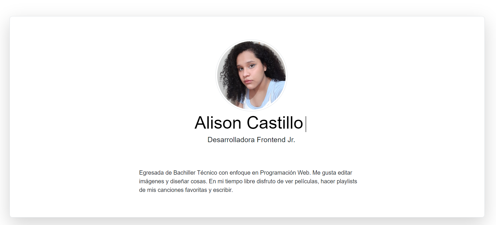

# Portafolio Responsivo con Bootstrap 5

El presente proyecto es creado para el bootcamp de Tecnolochicas PRO Summer Camp.

Es una página web responsiva (adaptable a diversos tamaños de pantalla).

El propósito del sitio web es mostrar el portafolio de proyectos de un(a) desarrollador(a).

Incluye una descripción de su motivación, experiencia, proyectos y formas de contacto.

También contiene una sección de almacenamiento de archivos (imágenes) que nos permiten modificar la imagen de perfil del desarrollador y contiene una animación desarrollada con JavaScript.

***

## Índice

- [Sobre el proyecto](https://github.com/alisoncastg/portafolio#sobre-el-proyecto)
- [Tecnologías](https://github.com/alisoncastg/portafolio#tecnolog%C3%ADas-utilizadas)
- [Contacto](https://github.com/alisoncastg/portafolio#contacto)

## Sobre el proyecto

El principal objetivo de la realización de este proyecto es demostrar los conocimientos que fueron adquiridos en el bootcamp de *Tecnolochicas PRO Summer Camp*, como fue mencionado anteriormente. 

¿Qué es lo que aprendimos? Aprendimos a hacer páginas web responsivas, utilizando HTML, CSS, Bootstrap y JavaScript.

En este caso, se realizó nuestro portafolio, que incluye varios proyectos realizados por nosotras.

## Tecnologías utilizadas

<!--Para el proyecto-->
Esta página fue creada con:

* HTML 5
* CSS 3
* JavaScript
* Bootstrap 5

Además se incluyen *Google Fonts*.

## Idioma

El texto de la página web está escrito en español, sin embargo las clases relacionadas con Bootstrap se incluyen en inglés.

## Contacto

Desarrollado en Tecnolochicas PRO Summer Camp por [Alison Castillo](Link)

